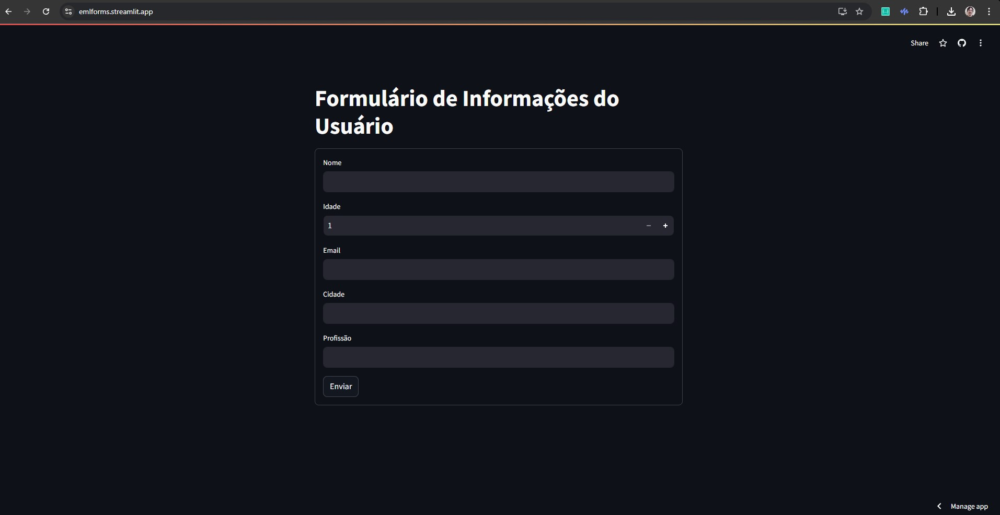

Este projeto é um aplicativo simples desenvolvido com Python e Streamlit que coleta informações do usuário através de um formulário. O formulário solicita cinco informações: Nome, Idade, Email, Cidade e Profissão. Após a submissão, os dados são salvos em um arquivo JSON, que pode ser baixado diretamente através do aplicativo. O arquivo JSON gerado é automaticamente excluído após o download, garantindo uma experiência limpa e segura. O código é uma demonstração prática das capacidades do Streamlit para criar interfaces interativas e gerenciar arquivos, ideal para quem deseja entender melhor como integrar coleta de dados e geração de arquivos com aplicações web em Python.

